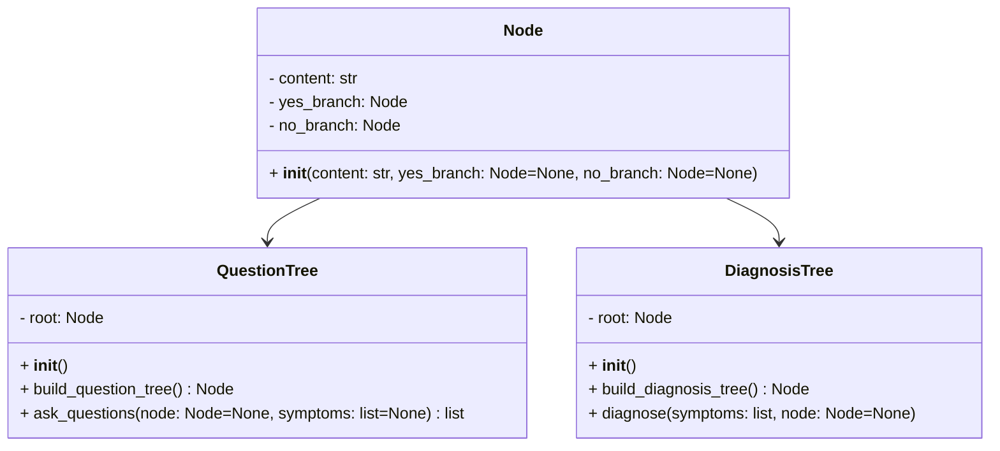
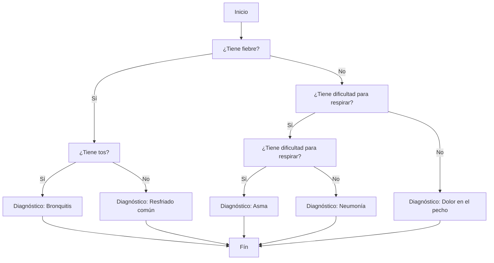

# Sistema de Diagnóstico de Enfermedades Respiratorias

## Pseudocódigo para el Sistema de Diagnóstico de Enfermedades Respiratorias

### Definición de la Clase `Node`
```pseudocode
Clase Node:
    Atributo: content (tipo cadena)
    Atributo: yes_branch (tipo Node, inicializado a None)
    Atributo: no_branch (tipo Node, inicializado a None)

    Método __init__(content, yes_branch=None, no_branch=None):
        Inicializa el nodo con el contenido y las ramas correspondientes
```

### Definición de la Clase `QuestionTree`
```pseudocode
Clase QuestionTree:
    Atributo: root (tipo Node)

    Método __init__():
        Construye el árbol de preguntas llamando a build_question_tree()

    Método build_question_tree() -> Node:
        Define las preguntas y síntomas:
            Crear nodo para "Tos"
            Crear nodo para "Fiebre"
            Crear nodo para "Dificultad para respirar"
            Crear nodo para "Dolor en el pecho"
        
        Construir el árbol de preguntas:
            Nodo1: "¿Tiene tos?" (Sí -> Nodo "Tos", No -> Nodo "Fiebre")
            Nodo2: "¿Tiene dificultad para respirar?" (Sí -> Nodo "Dificultad para respirar", No -> Nodo "Dolor en el pecho")
            Raíz: "¿Tiene fiebre?" (Sí -> Nodo1, No -> Nodo2)
        
        Retornar la raíz del árbol de preguntas

    Método ask_questions(node=None, symptoms=None) -> list:
        Si node es None, asignar root a node
        Si symptoms es None, inicializar symptoms como una lista vacía
        
        Si node no tiene ramas (es una hoja):
            Agregar el contenido del nodo a symptoms
            Retornar symptoms
        
        Preguntar al usuario la pregunta en node.content
        Si el usuario responde "sí":
            Agregar node.content a symptoms
            Llamar recursivamente a ask_questions con yes_branch
        Si el usuario responde "no":
            Llamar recursivamente a ask_questions con no_branch
        Si no:
            Mostrar un mensaje para que el usuario responda con "sí" o "no"
            Llamar recursivamente a ask_questions
```

### Definición de la Clase `DiagnosisTree`
```pseudocode
Clase DiagnosisTree:
    Atributo: root (tipo Node)

    Método __init__():
        Construye el árbol de diagnóstico llamando a build_diagnosis_tree()

    Método build_diagnosis_tree() -> Node:
        Define los diagnósticos:
            Crear nodo para "Asma"
            Crear nodo para "Bronquitis"
            Crear nodo para "Neumonía"
            Crear nodo para "Resfriado común"
        
        Construir el árbol de diagnóstico:
            Nodo1: "¿Tiene tos?" (Sí -> Nodo "Bronquitis", No -> Nodo "Resfriado común")
            Nodo2: "¿Tiene dificultad para respirar?" (Sí -> Nodo "Asma", No -> Nodo1)
            Raíz: "¿Tiene fiebre?" (Sí -> Nodo "Neumonía", No -> Nodo2)
        
        Retornar la raíz del árbol de diagnóstico

    Método diagnose(symptoms, node=None):
        Si node es None, asignar root a node

        Si node no tiene ramas (es una hoja):
            Mostrar el diagnóstico final node.content
            Retornar
        
        Si node.content está en symptoms:
            Llamar recursivamente a diagnose con yes_branch
        Si no:
            Llamar recursivamente a diagnose con no_branch
```

### Flujo Principal del Programa
```pseudocode
Iniciar el programa:
    Mostrar "Bienvenido al sistema de diagnóstico de enfermedades respiratorias."

    Crear una instancia de QuestionTree
    Llamar a ask_questions() para recopilar los síntomas

    Mostrar "Basado en sus respuestas, se procederá al diagnóstico..."

    Crear una instancia de DiagnosisTree
    Llamar a diagnose() para determinar el diagnóstico basado en los síntomas recopilados
```

---

### Explicación

- **Node**: Cada `Node` representa un punto en el árbol, ya sea una pregunta o un diagnóstico.
- **QuestionTree**: Esta clase guía al usuario a través de una serie de preguntas para identificar síntomas. El árbol se construye de tal manera que se realiza una serie de preguntas encadenadas.
- **DiagnosisTree**: Esta clase toma los síntomas identificados y los utiliza para navegar en un árbol que concluye con un diagnóstico.
- **Flujo Principal**: El programa comienza preguntando los síntomas y luego proporciona un diagnóstico basado en las respuestas del usuario.

## Diagrama de Clases


## Diagrama de Flujo



